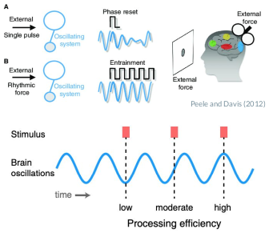
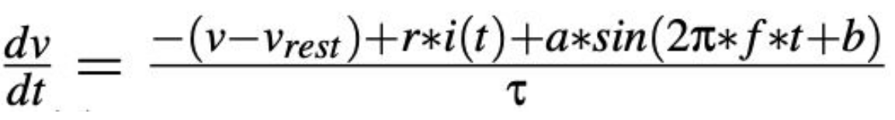

### Welcome to my project!

This site showcases my implementation and manipulation of the theoretical entrainment model presented in the paper ["A Computational Model of Auditory Entrainment"](https://www2.securecms.com/CCNeuro/docs-0/592888da68ed3f664d8a2567.pdf) by Saleh and Tomasso. First, the neccessary background information is presented in order to understand both the theory and implementation of the model presented. Next, the project objectives, methods, code, and results are showcased.

### Auditory Entrainment
* **Entrainment**: Synchronization of an oscillatory system(s) to an external rhythm/system
   * More efficient processing of stimuli
* Entrainment of auditory neurons depends on properties of input stimuli: amplitude (volume), frequency, and rhythm
* Entrainment is more likely to occur...
   * As stimulus frequency approaches intrinsic frequency and as stimulation intensity increases
* Plays an important role in auditory selective attention





### Project Objective
* Implement the computational model of auditory neurons presented in the paper, A Computational Model of Auditory Entrainment.
* Explore the behaviour of our model when the intrinsic neuronal properties change.
* Give the neuron a pure tone input (sinusoidal current) instead of a step current.

### Methods
* Primary auditory neurons were modeled as phase-locked leaky integrate-and-fire (PL-LIF) cells by modifying the standard LIF equation as follows:



## Results


You can use the [editor on GitHub](https://github.com/shaanverma/Computational-Model-of-Auditory-Entrainment/edit/gh-pages/index.md) to maintain and preview the content for your website in Markdown files.

Whenever you commit to this repository, GitHub Pages will run [Jekyll](https://jekyllrb.com/) to rebuild the pages in your site, from the content in your Markdown files.

### Markdown

Markdown is a lightweight and easy-to-use syntax for styling your writing. It includes conventions for

```markdown
Syntax highlighted code block

# Header 1
## Header 2
### Header 3

- Bulleted
- List

1. Numbered
2. List

**Bold** and _Italic_ and `Code` text


```

For more details see [GitHub Flavored Markdown](https://guides.github.com/features/mastering-markdown/).

### Jekyll Themes

Your Pages site will use the layout and styles from the Jekyll theme you have selected in your [repository settings](https://github.com/shaanverma/Computational-Model-of-Auditory-Entrainment/settings/pages). The name of this theme is saved in the Jekyll `_config.yml` configuration file.

### Support or Contact

Having trouble with Pages? Check out our [documentation](https://docs.github.com/categories/github-pages-basics/) or [contact support](https://support.github.com/contact) and we’ll help you sort it out.
